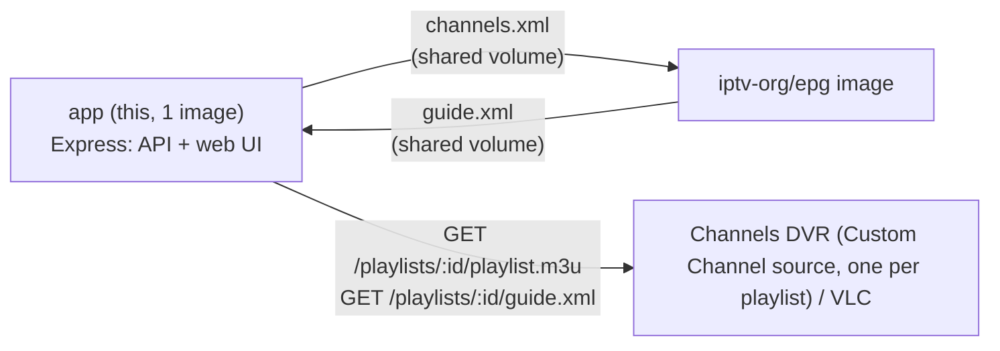

# iptv-catalog

TypeScript/Express API + React web UI that mirrors the [iptv-org](https://github.com/iptv-org)
channel catalog into SQLite, lets you build custom playlists by selecting channels, tests them
for reachability on a schedule, and exposes each playlist as a stable per-GUID M3U + XMLTV URL
you can drop straight into Channels DVR (or VLC) as a Custom Channel source.

Single Docker image: Express serves the API, the built React frontend as static files, and the
public M3U/EPG URLs, all from one Node process. A second container runs the official
`iptv-org/epg` guide generator as a sidecar.

## How it fits together



- The **app** container fetches `channels.json`, `streams.json`, and `guides.json` from
  iptv-org's public API and flattens them into a local SQLite table (refreshed on a schedule,
  editable from the Settings page).
- You create a **playlist** by selecting channels in the web UI (or `POST`ing a name + channel
  ids). Each playlist gets a UUID and two public URLs: `/playlists/:id/playlist.m3u` and
  `/playlists/:id/guide.xml`.
- Whenever a playlist's channel selection changes, the app regenerates a `channels.xml` scoped
  to only the channels actually used across all your playlists and drops it in a shared volume.
- The official `ghcr.io/iptv-org/epg` image reads that `channels.xml` on its own cron schedule
  and writes `guide.xml` back to the same shared volume.
- A scheduler periodically tests each playlist's stream URLs for reachability and raises
  dismissible notifications (with optional webhook alerts) when something's down. When a primary
  stream fails, the tester automatically walks any known fallback URLs for that channel in
  priority order and promotes the first working one to primary.

## Running it

```bash
docker compose up -d --build
```

This starts two containers:

- `iptv-catalog` — the app: web UI + API, port 3000
- `iptv-catalog-epg` — no exposed port needed; it only writes to the shared volume

Open `http://<host>:3000` for the web UI.

### Route layout

- `/` and any other unrecognized path → the React SPA
- `/api/*` → the JSON management API used by the web UI
- `/playlists/:id/playlist.m3u` and `/playlists/:id/guide.xml` → public files for Channels DVR/VLC
- `/health` → `{ ok: true, version: "x.y.z" }` — useful for container health checks

## Environment variables

None are required — all have working defaults.

| Variable | Default | Description |
|---|---|---|
| `PORT` | `3000` | Port Express listens on inside the container. |
| `DATA_DIR` | `/app/data` | Where `catalog.db` lives. |
| `EPG_SHARED_DIR` | `/app/epg-shared` | Shared volume for `channels.xml` and `guide.xml`. |
| `LOG_LEVEL` | `info` | `error` \| `warn` \| `info` \| `debug`. |
| `IPTV_ORG_API_BASE` | `https://iptv-org.github.io/api` | Source for `channels.json`/`streams.json`/`guides.json`. |
| `FEED_TEST_TIMEOUT_MS` | `8000` | Per-channel reachability check timeout. |
| `FEED_TEST_CONCURRENCY` | `10` | Max simultaneous stream checks per playlist test. |
| `FEED_TEST_TICK_CRON` | `*/15 * * * *` | How often the scheduler checks which playlists are due. |
| `WEBHOOK_TIMEOUT_MS` | `5000` | Webhook delivery timeout. |
| `TZ` | unset (UTC) | Container timezone, e.g. `America/New_York`. Affects cron schedule and displayed timestamps. |
| `VPN_HEALTH_CHECK_CRON` | `*/5 * * * *` | How often registered VPN/geo-proxy endpoints are health-checked. |
| `VPN_HEALTH_CHECK_URL` | `https://api.ipify.org?format=json` | URL fetched through each VPN endpoint to confirm it's reachable (also used to report the exit IP). |

## Usage

### Web UI

- **Overview** — catalog sync status, EPG guide health, playlist/channel counts, active alert
  counts, each with a quick link to the relevant page.
- **Browse Channels** — filter by search, country, category, stream/EPG availability. Channels
  with NSFW content show a red `NSFW` badge. Select channels individually or use the page
  checkbox to select all visible. A **Block N** button in the selection bar bulk-blocks every
  selected channel at once. Click any channel name for a detail modal showing stream quality
  badge, fallback stream count, playlist membership, and a live stream preview.
- **Playlists** — channel count, per-playlist check interval, channel-number start, **Export**
  (M3U/EPG URLs + VLC/Channels DVR instructions), **Push to Channels DVR** (one-click if a DVR
  URL is configured in Settings), **Export backup / Import backup**, **Duplicate**, **Rename**,
  **Edit channels**, **Delete**.
- **Notifications** — bell icon in the header shows an unread dot when alerts exist. Active
  feed-failure and auto-removal alerts, individually or bulk dismissible.
- **Settings** — appearance, catalog refresh schedule, EPG health, auto-remove, blocklists,
  integrations, advanced options. See [Settings](#settings).

### API

All management endpoints are under `/api`:

```bash
# Browse the catalog
curl "http://localhost:3000/api/channels?country=US&search=news&hasStream=true"

# Create a playlist
curl -X POST http://localhost:3000/api/playlists \
  -H "Content-Type: application/json" \
  -d '{"name": "News Bundle", "channelIds": ["CNNInternational.us", "BBCWorldNews.uk"]}'

# Update channel selection
curl -X PATCH http://localhost:3000/api/playlists/<id> \
  -H "Content-Type: application/json" \
  -d '{"channelIds": ["CNNInternational.us"]}'

# Push playlist to Channels DVR
curl -X POST http://localhost:3000/api/playlists/<id>/push-to-dvr

# Block a channel (removes from all playlists, hides from catalog)
curl -X POST http://localhost:3000/api/channels/<id>/block

# Check app version
curl http://localhost:3000/health
```

Other endpoints: `DELETE /api/playlists/:id`, `POST /api/playlists/:id/test`,
`POST /api/playlists/:id/duplicate`, `GET/POST /api/playlists/:id/export`,
`POST /api/playlists/import`, `GET/PATCH /api/settings`, `GET /api/notifications`,
`PATCH /api/notifications/:id`, `POST /api/notifications/dismiss-all`,
`GET /api/channels/:id/streams`, `GET /api/channels/:id/playlists`,
`GET /api/channels/blocked`, `DELETE /api/channels/:id/block`,
`GET /api/backup/playlists`, `POST /api/backup/export`, `POST /api/backup/import`,
`GET/POST /api/vpn-endpoints`, `PATCH/DELETE /api/vpn-endpoints/:id`,
`POST /api/vpn-endpoints/:id/check`, `GET /api/channels/vpn-assignments`,
`PUT/DELETE /api/channels/:id/vpn`.

## Channel numbering & source limits

Each channel in a playlist's M3U gets an explicit `channel-number` tag, assigned sequentially
from a per-playlist base (default 1, editable on the Playlists page). Channels DVR caps a single
Custom Channel source at 500 channels — the Playlists page flags any playlist over that limit.

## Blocklists

Configured in Settings → Blocklists. All blocklists apply immediately to Browse Channels and
purge matching channels from existing playlists on save.

- **Block countries** — dropdown picker, stored as ISO country codes. Channels from blocked
  countries are hidden catalog-wide.
- **Block categories** — dropdown picker. Channels in blocked categories are hidden.
- **Block stream domains** — comma-separated substrings matched against stream URLs.
- **Block NSFW** — hides all channels flagged as adult content in the iptv-org catalog.
- **Block channel** — per-channel Block button in the Browse Channels table (or the detail
  modal). Individually blocked channels are listed in Settings → Blocklists with an unblock (×)
  button.

## Channels DVR integration

Set your Channels DVR URL (e.g. `http://192.168.1.50:8089`) in Settings → Integrations. Once
set, each playlist's action menu gains a **Push to Channels DVR** button that registers the
playlist's M3U as a source in one click — no copy/paste needed.

The M3U/EPG URLs are permanent (UUID-based) and don't change as you edit channel selection, so
adding the source once is all that's needed.

## Geo-routing selected channels through a VPN

Some streams are geo-restricted to a specific country. Rather than proxying everything through
one VPN, you can register any number of named VPN "endpoints" and assign specific channels to
route through them — other channels keep connecting directly.

1. **Run a VPN sidecar container per country** on the same Docker network as the app. `docker-compose.yml`
   ships with two disabled example services (`gluetun-uk`, `gluetun-us`) using
   [gluetun](https://github.com/qmcgaw/gluetun), which connects to a VPN provider and exposes a
   local HTTP proxy (`HTTPPROXY=on`, port 8888) for other containers to use. Fill in your VPN
   provider's credentials, then start them with:
   ```bash
   docker compose --profile vpn up -d
   ```
   Any container that can reach an HTTP/HTTPS or SOCKS5 proxy address works here — gluetun is one
   option, not a requirement.
2. **Register the endpoint** in Settings → "VPN / geo-proxy endpoints": give it a name, optional
   country code, and the proxy address (e.g. `http://gluetun-uk:8888`). The app checks reachability
   every few minutes (`VPN_HEALTH_CHECK_CRON`) and shows Up/Down status plus the exit IP.
3. **Assign channels to it** — open a channel in Browse Channels and pick the endpoint from the
   "Route via VPN" dropdown (or leave it "Direct" for no proxy).

Assigned channels' stream URLs are rewritten in the exported M3U to go through this server's
`/api/stream-proxy` route, which forwards the request through the assigned endpoint's proxy — so
Channels DVR/VLC and the in-app preview all honor the routing without any client-side
configuration. Unassigned channels are unaffected and stream directly as before.

## Feed testing & fallback streams

Each playlist has its own check interval (default every 6 hours). A scheduler ticks every 15
minutes and runs tests for any playlist whose interval has elapsed.

- Testing uses a `HEAD` request (falling back to `GET`) with an 8-second timeout.
- Up to 10 channels are tested simultaneously (configurable via `FEED_TEST_CONCURRENCY`).
- If a channel's primary stream fails, the tester walks all known fallback URLs for that channel
  in priority order. The first working URL is automatically promoted to primary — the channel
  stays in the playlist and continues playing without any manual intervention.
- A failing channel (where all fallbacks also fail) gets a notification and a `⚠` prefix in the
  M3U display name. If it recovers on a later check, the notification auto-resolves.
- **Auto-removal** is opt-in (Settings → Channel health). When enabled, a channel is dropped
  after N consecutive failures. A "removed" notification replaces the failure notification; the
  M3U regenerates automatically.

## Settings

Stored in SQLite, editable from the web UI or `PATCH /api/settings`, no restart needed:

- **Appearance** — light, dark, or follow system (server-side, shared across all users).
- **Catalog refresh schedule** — presets or custom cron expression.
- **EPG staleness threshold** — how old `guide.xml` can be before a warning is shown.
- **Auto-remove** — toggle + consecutive-failure threshold.
- **Blocklists** — countries, categories, stream domains, NSFW, per-channel blocks.
- **Webhook URL** — fires on channel failure or auto-removal. See [Webhook notifications](#webhook-notifications).
- **Channels DVR URL** — enables one-click push from the Playlists page.
- **Public URL override** — the host:port used in M3U/EPG URLs. Leave blank for auto-detect.

## Webhook notifications

Set a URL in Settings → Integrations. A `POST` fires when a channel starts failing or gets
auto-removed:

```json
{ "event": "channel_failing", "playlistName": "News", "channelName": "CNN International", "message": "HTTP 404", "timestamp": "..." }
{ "event": "channel_removed", "playlistName": "News", "channelName": "CNN International", "message": "Removed after 3 consecutive failed checks", "timestamp": "..." }
```

Fire-and-forget with a 5-second timeout. Works with Home Assistant's REST/webhook trigger.

## Backup & restore

- **Export backup** — pick any combination of playlists and optionally include app settings.
  Downloads one `iptv-catalog-backup.json`. (`publicBaseUrl` is excluded — it's machine-specific.)
- **Import backup** — preview what's inside (per-playlist checkboxes + optional settings),
  choose exactly what to apply. Accepts both the multi-playlist backup format and the older
  single-playlist export format.
- **Duplicate** — copies a playlist's channels and settings into a new one named `<name> (copy)`.

## Versioning & releases

The app version is read from `package.json` at startup and surfaced in:
- `GET /health` → `{ ok: true, version: "x.y.z" }`
- `GET /api/settings` → includes `version`
- Settings page footer
- Server startup log

To cut a release:

```bash
./scripts/release.sh
```

Prompts for bump type (patch/minor/major), optional release message, updates `package.json` and
`CHANGELOG.md`, commits both, creates a `vX.Y.Z` git tag, and offers to push. Pushing the tag
triggers the GitHub Actions workflow (`.github/workflows/release.yml`) which creates a GitHub
Release with auto-generated notes.

## EPG sidecar health

The `iptv-org/epg` container runs on its own schedule (its own `CRON_SCHEDULE` env var). The
staleness threshold (default 12 hours, editable in Settings) controls when the Overview and
Settings pages flag `guide.xml` as stale. The check runs every 15 minutes alongside the feed
tester.

On a fresh install with no playlists, `channels.xml` is empty so the startup grab produces
nothing — this shows as a gray "nothing to generate yet" state rather than a red warning. Once
you've created a playlist, restart the epg container to trigger an immediate grab:

```bash
docker restart iptv-catalog-epg
```

## Logging

Set `LOG_LEVEL` env var (default `info`): `error`, `warn`, `info`, `debug`.

- `error` — failed catalog fetches, DB errors
- `warn` — recoverable issues, epg going stale
- `info` — boot sequence (including version), catalog refresh results, playlist changes
- `debug` — every HTTP request with status + timing, cron scheduling detail

## Notes and known limitations

- **EPG coverage isn't universal** — only channels in iptv-org's `guides.json` get program data.
- **First EPG grab takes time** — `guide.xml` requests return `202` until the sidecar completes
  its first run.
- **Stream reliability** — inherent to iptv-org's source list; some streams are geo-restricted
  or go offline.
- **No auth** — any host on your network can hit `/api/*`. Fine for LAN-only homelab use.

## Local dev (without Docker)

```bash
npm install
npm run dev
```

For the full stack (frontend hot-reload proxied to the backend):

```bash
# terminal 1
npm run dev

# terminal 2
cd frontend && npm install && npm run dev
```

The frontend dev server proxies `/api` to `localhost:3000` automatically (see `vite.config.ts`).
The epg sidecar won't be running locally — `guide.xml` requests return `202` until you either
run the epg container separately or manually place a `guide.xml` in `EPG_SHARED_DIR`.
